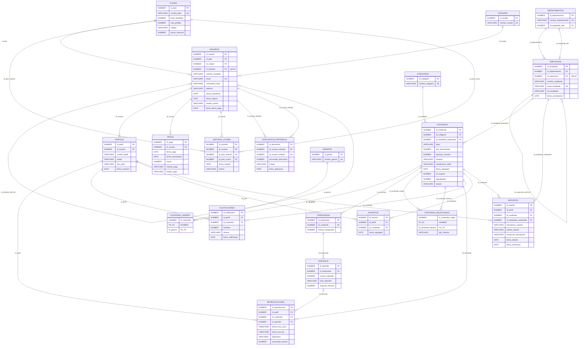

# QUINDIOFLIX - MODELO ENTIDAD-RELACIÓN (MER)
## Proyecto Final - Bases de Datos II
### Universidad del Quindío

---

## 1. PRESENTACIÓN DEL MODELO
El Modelo Entidad-Relación (MER) de QuindioFlix consta de **20 entidades** perfectamente normalizadas e interconectadas. Este diseño soporta toda la lógica de la aplicación de streaming, garantizando la consistencia y eliminando la redundancia de datos.

A continuación se detalla el diagrama relacional completo en formato **Mermaid.js**, un estándar de modelado de texto moderno e interactivo que puede renderizarse directamente en múltiples herramientas y exportarse en alta definición a **PNG o PDF**.

---

## 2. DIAGRAMA ENTIDAD-RELACIÓN COMPLETO (Mermaid.js)

---

## 3. INSTRUCCIONES DE EXPORTACIÓN (Para obtener PNG o PDF Profesional)
Para presentar este diagrama en la sustentación final y en los entregables físicos (Word/PDF) con una calidad óptima y vectorizada, siga estos sencillos pasos:

### Opción A: A través de Mermaid Live Editor (Recomendado)
1.  Copie el bloque de código de arriba (desde `erDiagram` hasta el corchete de cierre del final).
2.  Abra su navegador de internet e ingrese al editor oficial en línea: **[mermaid.live](https://mermaid.live)**.
3.  Pegue el código copiado en el panel izquierdo titulado **"Code"**.
4.  El diagrama se renderizará automáticamente en tiempo real en la pantalla derecha en un lienzo interactivo de alta resolución.
5.  En el panel izquierdo inferior, haga clic en el botón **"Actions"**:
    *   Para **PNG**: Haga clic en **"PNG"** para descargar la imagen en alta definición.
    *   Para **PDF**: Haga clic en **"SVG"** (formato vectorial), ábralo en su navegador de preferencia y seleccione la opción "Imprimir como PDF", o use un conversor online de SVG a PDF para obtener un documento nítido y sin pérdida de calidad al hacer zoom.

### Opción B: A través de VS Code (Con extensiones de Markdown)
1.  Si está visualizando este archivo dentro de **Visual Studio Code**, asegúrese de tener instalada la extensión **"Markdown Preview Mermaid Support"** o **"Mermaid Preview"**.
2.  Presione `Ctrl + Shift + V` para abrir la vista previa de este archivo Markdown. El diagrama se dibujará de forma totalmente nativa en la pantalla.
3.  Haga clic derecho en el diagrama y seleccione la opción **"Save Diagram As"** para guardarlo como PNG en su computadora.
